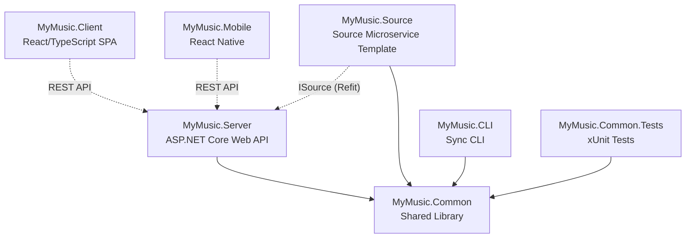
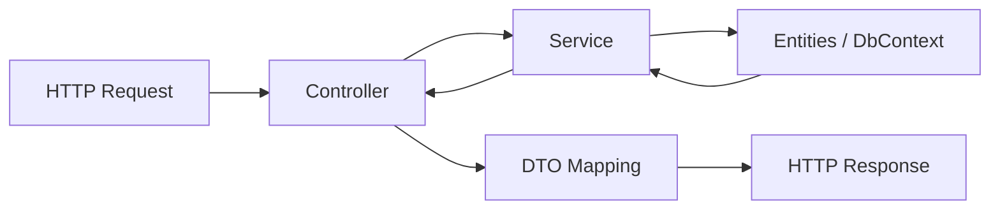
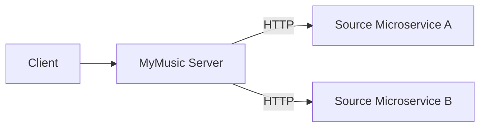

# MyMusic

Self-hosted music management system with bi-directional sync, metadata auditing, external source integration, and a modern web player. Built on .NET 9.0 with a React/TypeScript SPA frontend.

## Development

### Prerequisites

- .NET 9.0 SDK
- Node.js 22+ and npm
- PostgreSQL 17

### Build

```bash
dotnet build
```

### Run Tests

```bash
dotnet test
```

### Run the Server

```bash
dotnet run --project MyMusic.Server
```

The API is available at `http://localhost:5000`. OpenAPI docs are served at `/openapi/v1.json` (Scalar UI in development).

### Run the Client

```bash
cd MyMusic.Client && npm install && npm run dev
```

The dev server runs at `http://localhost:5173` and proxies `/api` requests to the backend.

### Run the CLI

```bash
dotnet run --project MyMusic.CLI -- init -s http://localhost:5000/api -u myuser -d "My Laptop" -t Laptop -r /home/user/Music -y
dotnet run --project MyMusic.CLI -- sync
```

## Configuration

### Environment Variables

Environment variables prefixed with `MYMUSIC_` override any `appsettings.json` key using `__` as the section separator (standard .NET hierarchical configuration).

| Variable | Description |
|---|---|
| `MYMUSIC_USER_ID` | Override the default user ID (defaults to `1`) |
| `MYMUSIC_HEADER_ID_ENABLED` | Set to `1` or `true` to read the user identity from `X-MyMusic-UserId` or `X-MyMusic-UserName` HTTP headers |
| `MYMUSIC_CONNECTIONSTRINGS__POSTGRES` | PostgreSQL connection string |
| `MYMUSIC_MYMUSIC__MUSICREPOSITORYPATH` | Path to the music repository on disk |
| `MYMUSIC_MYMUSIC__SEEDPATH` | Path to the seed JSON file |
| `MYMUSIC_MYMUSIC__BITRATEBACKFILLENABLED` | Enable automatic bitrate backfill (`true`/`false`) |

### Appsettings File Locations

| File | Purpose |
|---|---|
| `MyMusic.Server/appsettings.json` | Server: DB connection, music repo path, server URLs, audit thresholds, thumbnail cache |
| `MyMusic.Server/appsettings.Development.json` | Dev overrides (log levels per namespace) |
| `MyMusic.CLI/appsettings.json` | CLI: server URL, device name/icon, repository path, exclude patterns, sync chunk size |
| `MyMusic.CLI/appsettings.development.json` | Dev overrides for CLI |
| `MyMusic.Source/appsettings.json` | Source microservice: minimal (logging only) |

### Sample `appsettings.json` (Server)

```json
{
  "Logging": {
    "LogLevel": {
      "Default": "Information",
      "Microsoft.AspNetCore": "Warning"
    }
  },
  "AllowedHosts": "*",
  "ConnectionStrings": {
    "Postgres": "Host=localhost;Port=5432;Username=postgres;Password=postgres;Database=my-music"
  },
  "MyMusic": {
    "MusicRepositoryPath": "/app/data/music",
    "SeedPath": "/app/config/seed.json",
    "BitrateBackfillEnabled": true
  },
  "MyMusicServer": {
    "ClientUrl": "http://localhost:5000",
    "ApiBasePath": "/api"
  },
  "Audit": {
    "MediumCoverThreshold": 1080,
    "SmallCoverThreshold": 500,
    "SoundalikeMatchThreshold": 0.90,
    "SoundalikeLookupThreshold": 0.25
  },
  "ThumbnailCache": {
    "MaxCacheSizeBytes": 104857600,
    "MaxEntrySizeBytes": 5242880,
    "EntryTtlMinutes": 60,
    "ProxyPathPrefix": "/api/sources/thumbnails/"
  }
}
```

### Configuration Sections

| Section | Class | Description |
|---|---|---|
| `MyMusic` | `Config` | Repository path, seed path, naming template, wishlist interval, bitrate backfill |
| `MyMusicServer` | `ServerConfig` | Client URL and API base path |
| `Audit` | `AuditConfig` | Cover size thresholds and soundalike matching thresholds |
| `ThumbnailCache` | `ThumbnailCacheConfig` | In-memory thumbnail proxy cache limits and TTL |
| `ConnectionStrings:Postgres` | (EF Core) | PostgreSQL connection string |

## Usage

### Docker Compose

The following example runs MyMusic behind a Caddy reverse proxy with PostgreSQL:

```yaml
services:
  caddy:
    image: caddy:2
    container_name: caddy
    restart: unless-stopped
    network_mode: host
    configs:
      - source: caddyfile
        target: /etc/caddy/Caddyfile

  my-music:
    container_name: my-music
    image: gitea.home/silvas/my-music:0.15.0
    restart: unless-stopped
    environment:
      MYMUSIC_HEADER_ID_ENABLED: 1
      MYMUSIC_CONNECTIONSTRINGS__POSTGRES: Host=my-music-db;Port=5432;Username=postgres;Password=postgres;Database=my-music
      MYMUSIC_MYMUSIC__MUSICREPOSITORYPATH: /app/data/music
      MYMUSIC_MYMUSIC__SEEDPATH: /app/config/seed.json
      TZ: Europe/Lisbon
    depends_on:
      my-music-db:
        condition: service_healthy
    volumes:
      - /etc/localtime:/etc/localtime:ro
      - my-music-data:/app/data
    networks:
      - my-music
    configs:
      - source: my-music-seed
        target: /app/config/seed.json

  my-music-ui:
    container_name: my-music-ui
    image: gitea.home/silvas/my-music-ui:0.15.0
    restart: unless-stopped
    networks:
      - my-music

  my-music-db:
    image: postgres:17
    container_name: my-music-db
    restart: unless-stopped
    environment:
      POSTGRES_DB: my-music
      POSTGRES_USER: postgres
      POSTGRES_PASSWORD: postgres
    volumes:
      - my-music-db:/var/lib/postgresql/data
    networks:
      - my-music
    healthcheck:
      test: ["CMD-SHELL", "pg_isready -U postgres -d my-music"]
      interval: 5s
      timeout: 5s
      retries: 5

configs:
  caddyfile:
    content: |
      sarah.my-music {
        handle_path /api/* {
          reverse_proxy http://my-music:8080 {
            header_up X-MyMusic-UserName sarah
          }
        }
        handle /* {
          reverse_proxy http://my-music-ui:8080
        }
      }
      claire.my-music {
        handle_path /api/* {
          reverse_proxy http://my-music:8080 {
            header_up X-MyMusic-UserName claire
          }
        }
        handle /* {
          reverse_proxy http://my-music-ui:8080
        }
      }
  my-music-seed:
    content: |
      {
        "users": [
          {
            "username": "sarah",
            "name": "Sarah Smith",
            "devices": [
              {"name": "Desktop", "icon": "IconDeviceDesktop", "NamingTemplate": "{{simple_label}}.mp3"},
              {"name": "Smartphone", "icon": "IconDeviceMobile", "NamingTemplate": "{{simple_label}}.mp3"}
            ]
          },
          {
            "username": "claire",
            "name": "Claire Smith",
            "devices": []
          }
        ],
        "sources": [
          {
            "name": "bandcamp",
            "icon": "IconBrandBandcamp",
            "address": "http://my-music-bandcamp:8080",
            "isPaid": true
          }
        ]
      }

volumes:
  my-music-data: {}
  postgres-data: {}

networks:
  my-music: {}
```

Key points:

- **Caddy** routes `/api/*` to the server and `/*` to the UI, injecting `X-MyMusic-UserName` for user identity
- **`MYMUSIC_HEADER_ID_ENABLED: 1`** enables reading the user from HTTP headers (required when Caddy injects the header)
- **Seed config** bootstraps users, devices, and sources on first run (migrations and seeding run automatically on startup)
- The server listens on port **8080** inside the container; the UI serves static files on port **8080**

## Architecture

### Solution Overview



### Folder Structure

```
my-music/
├── MyMusic.Common/          Shared library (entities, services, DbContext, migrations)
├── MyMusic.Server/          ASP.NET Core Web API (controllers, DTOs)
├── MyMusic.Source/          Source microservice template
├── MyMusic.CLI/             Command-line sync tool (Spectre.Console.Cli)
├── MyMusic.Client/          React/TypeScript SPA (Vite, Mantine UI)
├── MyMusic.Mobile/          React Native mobile app (Expo)
└── MyMusic.Common.Tests/    xUnit test project (NSubstitute + Shouldly)
```

### Server Request Flow



Controllers receive HTTP requests and delegate to services, which perform business operations using EF Core entities via `MusicDbContext`. Services return entity results to controllers, which map them to DTOs and return HTTP responses. Controllers and DTOs are organized by resource (Songs, Albums, Devices, Playlists, Sources, Audits, etc.) in `Controllers/` and `DTO/<Resource>/`.

### Multi-Tenancy

MyMusic uses **header-based tenant scoping** instead of authentication. The reverse proxy (e.g., Caddy) injects an `X-MyMusic-UserName` or `X-MyMusic-UserId` header into every request, and the server resolves the current user from that header. All data is scoped by `OwnerId` — each user only sees their own music library, devices, playlists, etc. Set `MYMUSIC_HEADER_ID_ENABLED=1` to enable this behavior.

### Decoupled Sources



Each external music provider runs as a **separate Source microservice**. Sources are configurable entries in the database (name, icon, address, isPaid). The server communicates with them over HTTP using a dynamically generated Refit client pointed at the source's address. A source microservice must implement the `ISource` contract:

- `SearchSongsAsync(query)` — search for songs
- `GetSongAsync(id)` — get song details
- `PurchaseSongAsync(id)` — purchase/download a song
- `SearchAlbumsAsync(query)` — search for albums
